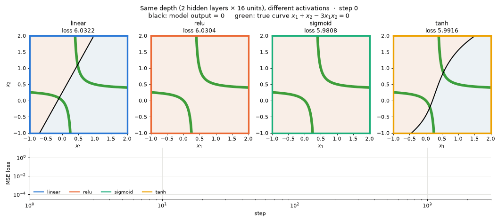
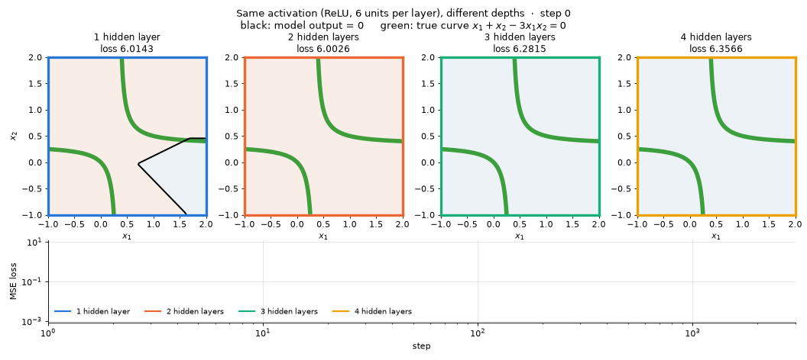

# CSC311 NN as Universal Function Approximator

用 MLP 拟合曲线 $`x_1 + x_2 - 3x_1x_2 = 0`$，并对比两件事：**同层数下不同激活函数**的效果，以及**同激活函数下不同层数**的效果。

## 1. 问题设定

曲线 $`x_1 + x_2 - 3x_1x_2 = 0`$ 可以改写成 $`(x_1 - \tfrac13)(x_2 - \tfrac13) = \tfrac19`$，是一条以 $`x_1 = \tfrac13`$、$`x_2 = \tfrac13`$ 为渐近线的双曲线，有两支。

直接把它当成 $`x_2 = g(x_1)`$ 去拟合会在渐近线处发散，所以这里让网络去学曲线背后的函数

```math
f(x_1, x_2) = x_1 + x_2 - 3x_1x_2
```

曲线就是 $`f = 0`$ 的那条等高线。网络输入 $`(x_1, x_2)`$、输出一个实数 $`y`$，训练目标是 $`y \approx f(x_1, x_2)`$；模型学到的曲线就是 $`y = 0`$ 的等高线，和 XOR 项目里 $`y = 0.5`$ 的 decision boundary 是同一个角色。

- 数据：$`[-1, 2]^2`$ 上 41×41 的均匀网格（1681 个点）
- 训练：Adam（学习率 0.01），full-batch，MSE loss，固定更新 3000 次
- 每个配置都从同一个 seed（默认 0）出发做随机初始化

## 2. 运行

```bash
pip install torch matplotlib numpy pillow
python3 main.py            # 只训练并打印结果，不出图
python3 main.py --seed 3   # 换一个随机初始化
python3 main.py --images   # 同时重新生成 demo/ 里的两个 GIF
```

代码按职责拆成了几个文件，最后在 `main.py` 里组装：

| 文件 | 职责 |
| :--- | :--- |
| `data.py` | 目标函数 $`f`$、训练网格、曲线上的点 |
| `model.py` | 层数 / 宽度 / 激活函数可配置的 MLP |
| `train.py` | 训练循环，每次更新后通过回调把 step 和 loss 交给调用方 |
| `record.py` | 作为回调记录 loss 和模型在网格上的输出快照 |
| `plot.py` | 把几次训练的记录并排画成一帧、合成 GIF |
| `main.py` | 定义两组实验，把上面几部分组装起来并打印结果 |

## 3. 怎么看图

每个 GIF 上排一格对应一个超参配置：

- 背景颜色是模型输出 $`y`$（蓝负红正，白色接近 0）
- **黑线**是模型输出 $`y = 0`$ 的曲线，**绿线**是真正的曲线 $`f = 0`$，两者重合就说明拟合好了
- 每格边框的颜色对应下排 loss 曲线的颜色（横纵轴都是对数坐标）

表格里的「曲线误差」是在真实曲线上取点后模型输出的平均 $`|y|`$（理想值为 0）。

## 4. 同层数，不同激活函数

固定 2 个隐藏层、每层 16 个单元（参数量都是 337），只换激活函数。

<p align="center">
  
</p>

| 激活函数 | 最终 loss | 曲线误差 |
| :---: | :---: | :---: |
| linear（不加激活） | 5.5814 | 0.4845 |
| ReLU | 0.0037 | 0.0416 |
| sigmoid | 0.0004 | 0.0098 |
| tanh | 0.0001 | 0.0028 |

- **linear**：不加激活函数时，叠多少层都还是一个线性函数，$`y = 0`$ 只能是一条直线，学不出 $`x_1x_2`$ 这一项，loss 停在 5.58 不动。非线性激活是 universal approximation 的前提。
- **ReLU**：网络是分段线性的，所以黑线是一条折线，只能用折线段去逼近光滑的双曲线。
- **sigmoid / tanh**：激活函数本身光滑，学到的曲线也光滑，几乎和绿线完全重合。sigmoid 起步明显更慢（loss 曲线到 100 步左右才开始下降），tanh 最快也最准。

## 5. 同激活函数，不同层数

固定 ReLU、每层 6 个单元，隐藏层数从 1 到 4。

<p align="center">
  
</p>

| 隐藏层数 | 参数量 | 最终 loss | 曲线误差 |
| :---: | :---: | :---: | :---: |
| 1 | 25 | 0.0350 | 0.1065 |
| 2 | 67 | 0.0125 | 0.0722 |
| 3 | 109 | 0.0196 | 0.0826 |
| 4 | 151 | 0.0017 | 0.0354 |

- 1 个隐藏层时，6 个 ReLU 单元只能提供很少的"折点"，黑线是一条很粗糙的折线；层数增加后折线段变多，能更贴近曲线拐弯的地方。
- 趋势不是单调的：这个 seed 下 3 层反而比 2 层差。窄的 ReLU 网络对初始化很敏感，换 5 个 seed（0–4）后各层数最终 loss 的中位数分别是 0.177、0.023、0.011、0.017，其中 1 层和 2 层各有 seed 卡在 loss ≈ 1.49。结论是"比 1 层深明显更好，再往深收益不稳定"，而不是"越深越好"。
- 这里固定的是每层宽度，所以层数越多参数也越多，对比的是"加层"的整体效果，不是同参数量下的深 vs 宽。
